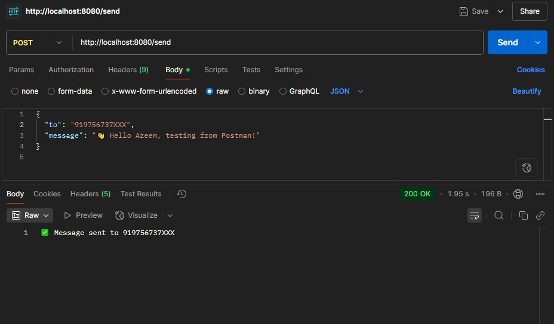
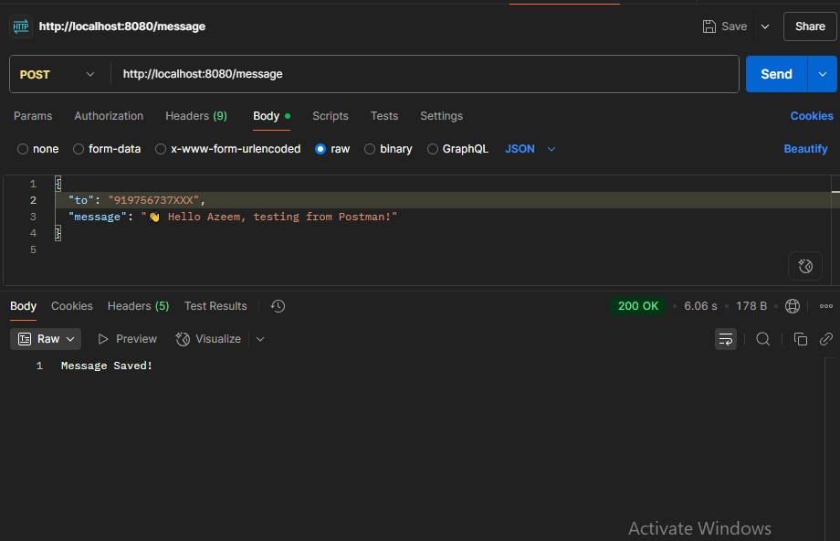

WhatsApp Chatbot using Java Spring Boot

A Spring Boot-based WhatsApp chatbot project that integrates with Meta’s WhatsApp Cloud API.  
It allows sending automated text messages through WhatsApp by hitting REST endpoints.

 Built with: Java 17, Spring Boot, MySQL, and deployed on Render.

Features

- Send text messages via WhatsApp Cloud API
- REST API built using Spring Boot
- MySQL for Data Store
- Easy deployment to Render or local machine
- Postman Tested and production-ready

Technologies Used

- **Java 17**
- **Spring Boot 3.x**
- **RESTful APIs**
- **MySQL for storing user/chat**
- **Render.com** (Cloud Deployment)
- **Maven**
- **Postman** (for testing)

 Project Structure
 src/
├── main/
│ ├── java/
│ │ └── com.azeem.whatsappbot/
│ │ ├── controller/
│ │ │ └── ChatController.java
│ │ ├── service/
│ │ │ └── WhatsAppService.java
│ │ └── WhatsAppBotApplication.java
│ └── resources/
│ └── application.properties
├── pom.xml

 Setup Instructions

 Clone the Repository

git clone https://github.com/Azeemkhan315/whatsapp-chatbot-springboot.git
cd whatsapp-chatbot-springboot

Configure application.properties
server.port=8080
whatsapp.phoneNumberId=YOUR_PHONE_NUMBER_ID
whatsapp.accessToken=YOUR_ACCESS_TOKEN

Build and Run
mvn clean install
java -jar target/*.jar
App will be live at: http://localhost:8080

API Example (Postman)
POST http://localhost:8080/api/send

{
  "to": "91XXXXXXXXXX",
  "text": "Hello from Spring Boot WhatsApp Bot!"
}
Response:

{
  "status": "Message sent successfully"
}

WhatsApp Cloud API Notes
Requires Facebook Developer Account
WhatsApp Business Test Number is free
Access Token, Phone Number ID are required
App must be in Development or Live Mode

Screenshots
Flow	Screenshot
API Test	
Meta Setup 

### 🔗 Live Render App:
https://whatsapp-chatbot.onrender.com

👤 Author
Name: Azeem Khan
Role: Backend Developer (Spring Boot, Java)
GitHub: github.com/Azeemkhan315
